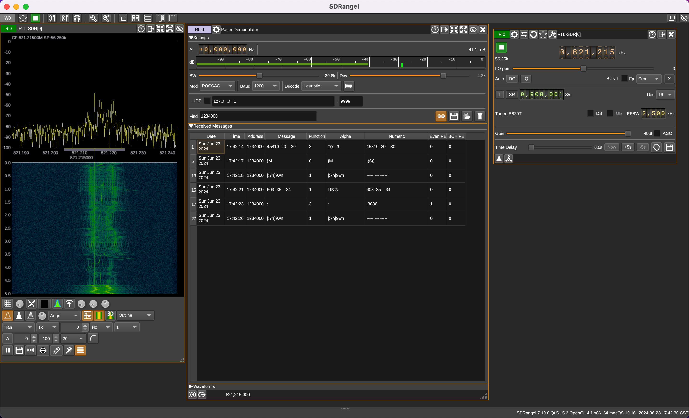

# Train

Track train POCSAG: 821.2375MHz

## Method 1

Start gqrx.

Mode change to "NFM" or "Narrow FM".

Frequency change to 821.2375MHz. (821.220MHz)

## Method 2 (not work)

```sh
$ brew tap dholm/homebrew-sdr
```

Error

```
$ brew install --HEAD dholm/sdr/multimon-ng
Error: dholm/sdr/multimon-ng: Unsupported special dependency :x11
```

Cannot work.

## Method 3

- Download sdrangel - https://github.com/f4exb/sdrangel/releases
- From top navbar click "Add Rx device" icon.
- Select "RTL-SDR[0] ..." from sampling device list.



### Update 2024-04-11

Frequency is `821,217` kHz.

On panel of "RTLSDR input plugin", increase "Gain" to `49.6`.

## See also

- 无线电工作手册 - 2.3 铁路专用通信系统 https://www.kancloud.cn/palwin/jianceshouce/284723 (https://docs.google.com/document/d/1RB6zF70guJFb0iqZ2l9Q8U390u6Ws1osJMCfxU-l1j0/edit)

## References

- google:"\"866.2375\""
- github:"\"列车接近预警\"" (https://github.com/search?q=%22%E5%88%97%E8%BD%A6%E6%8E%A5%E8%BF%91%E9%A2%84%E8%AD%A6%22&type=code)
