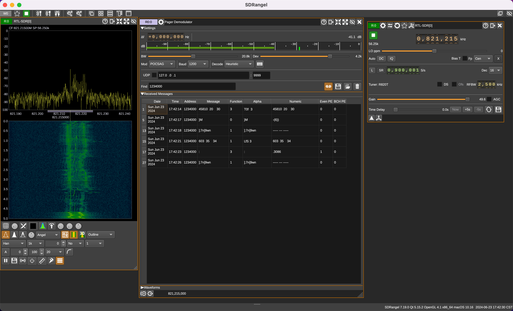

# SDR Guide

## Info

device name: DVB-T+FM+DAB (820T2 & SDR)

device: RTL2832U+R820T2

## Install and setup

Install rtl-sdr package.

```sh
$ brew install rtl-sdr
```

Insert device into USB port.

Run test (check the connection to the RTL-SDR device and its performance).

```sh
$ rtl_test # basic test
$ rtl_test -t # specifically performs a full tuner test
```

## Try GUI

### gqrx

```sh
$ brew install --cask gqrx # https://formulae.brew.sh/cask/gqrx
```

The first time you open the software you have to right-click it on the Icon in the application folder to open it up.

Select "Realtek RTL2838UHIDIR" from the "Device" dropdown.

### rtlsdr-scanner (not work)

```sh
$ pip3 install rtlsdr-scanner
$ python3 -m rtlsdr_scanner
```

## Try CUI

Listen to the radio

```sh
$ brew install sox # install sox, then can call `play` from command line
$ rtl_fm -f 90100000 -M wbfm -s 200000 -r 48000 - | play -r 48000 -t s16 -L -c 1  -
```
params of rtl_fm:
* `-f 90100000` 90,100,000 - FM 90.1MHz

An example output is something like:

```
Found 1 device(s):
  0:  Realtek, RTL2838UHIDIR, SN: 00000001

Using device 0: Generic RTL2832U OEM

-: (s2)

 File Size: 0
  Encoding: Signed PCM
  Channels: 1 @ 16-bit
Samplerate: 48000Hz
Replaygain: off
  Duration: unknown

In:0.00% 00:00:00.00 [00:00:00.00] Out:0     [      |      ]        Clip:0    Found Rafael Micro R820T tuner
Tuner gain set to automatic.
Tuned to 90316000 Hz.
Oversampling input by: 6x.
Oversampling output by: 1x.
Buffer size: 6.83ms
Sampling at 1200000 S/s.
Output at 200000 Hz.
In:0.00% 00:00:06.14 [00:00:00.00] Out:271k  [  ====|====  ]        Clip:0
```

Beijing Radio Stations (https://zh.wikipedia.org/wiki/北京市广播电台列表)

* 北京文艺广播	87.6
* 音乐之声	90.0

## Airplane (ADS-B)

### "Dump1090 Mac Server"(GUI) + ?

* Download https://github.com/mxswd/dump1090-mac-app
* Start "Dump1090 Mac Server"
* ...

### "rtl_tcp" + "Cocoa1090"

Download "Cocoa1090" from https://www.blackcatsystems.com/software/cocoa1090.html

```sh
$ rtl_tcp
```

Run "Cocoa1090".

## 公众对讲机（民用对讲机）：409-410MHZ

Start gqrx.

Mode change to "NFM" or "Narrow FM".

Frequency change to 409MHz.

## Track train POCSAG: 821.2375MHz

### Method 1

Start gqrx.

Mode change to "NFM" or "Narrow FM".

Frequency change to 821.2375MHz. (821.220MHz)

### Method 2 (not work)

```sh
$ brew tap dholm/homebrew-sdr
```

Error

```
$ brew install --HEAD dholm/sdr/multimon-ng
Error: dholm/sdr/multimon-ng: Unsupported special dependency :x11
```

Cannot work.

### Method 3

* Download sdrangel - https://github.com/f4exb/sdrangel/releases
* From top navbar click "Add Rx device" icon.
* Select "RTL-SDR[0] ..." from sampling device list.



#### Update 2024-04-11

Frequency is `821,217` kHz.

On panel of "RTLSDR input plugin", increase "Gain" to `49.6`.

## References

* https://osmocom.org/projects/rtl-sdr/wiki
* gqrx
  * https://danielpocock.com/quickstart-sdr-ham-radio-gqrx-gnu-radio/
  * https://www.turais.de/install-gqrx-in-mac-os-x/
* ADS-B 信号跟踪 - https://pdf.hanspub.org/CSA20220800000_13646785.pdf
