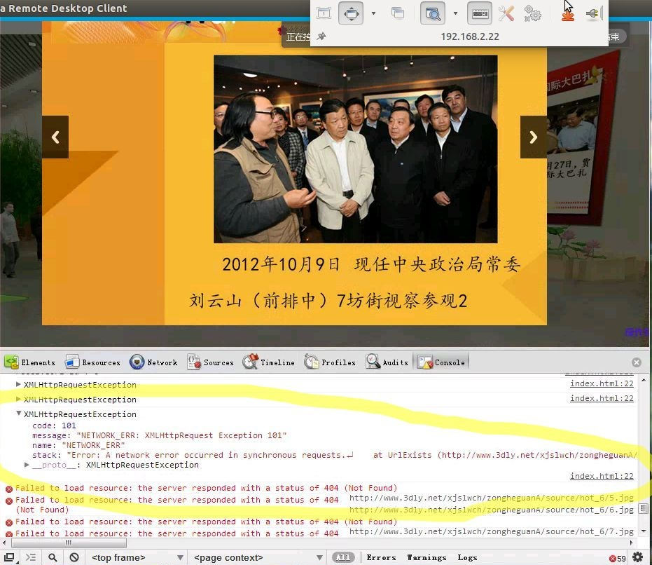
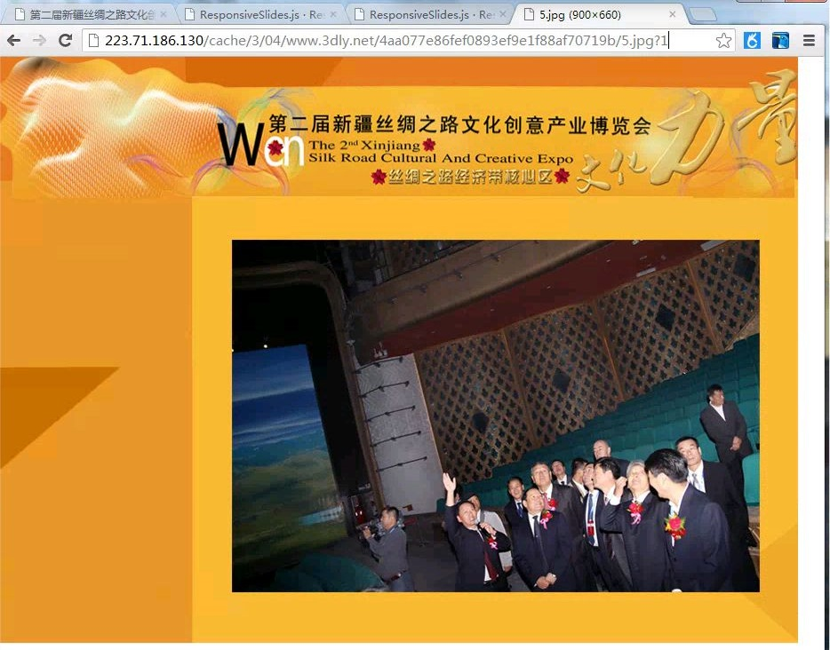

发生在人民大学校园网的事情，有一个项目放在3dly.net上，然后一个客户从人民大学校园网访问这个项目，静态图片能看到，但是通过js动态生成的图片看不到。

通过QQ远程协助，发现浏览器访问

    http://www.3dly.net/xjslwch/zongheguanA/source/hot_6/5.jpg

这样的地址的时候，被redirect到了223.71.186.130这台服务器上，地址变成了

    http://223.71.186.130/cache/3/04/www.3dly.net/4aa077e86fef0893ef9e1f88af70719b/5.jpg

