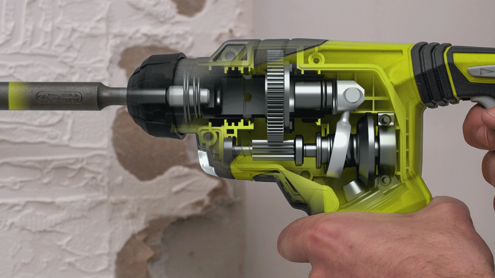
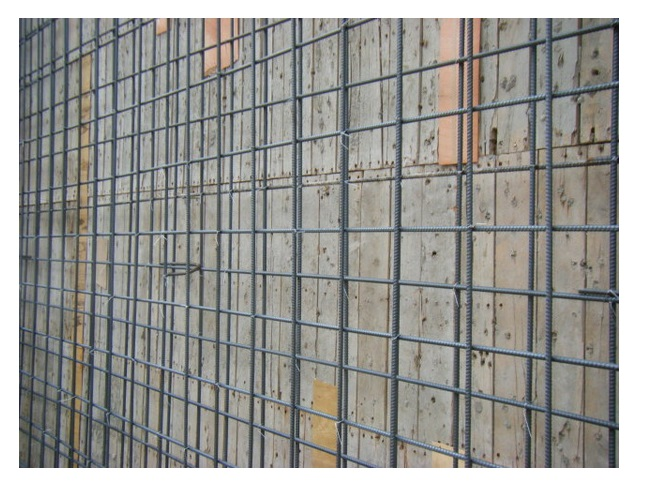

## 电锤

电锤，冲击钻

## 如何钻进混凝土

首先需要知道的是，混凝土硬度越高越难打，也就是打的越慢。

钻的时候要一按一松的频度施压，这样可以让冲击力得到最大的发挥。

## 样冲眼

为了让空的位置打得比较准确，最好先在确定了孔的位置之后，先用冲子（用钉子代替也可以）在空的位置上用锤子敲出一个定位孔，这就是“样冲眼”。

## 原理图

图片来源：[http://www.ebay.co.uk/itm/Ryobi-ONE-18V-Cordless-SDS-Rotary-Hammer-Drill-with-2-x-1-3Ah-Lithium-Batterie-/191698099852](http://www.ebay.co.uk/itm/Ryobi-ONE-18V-Cordless-SDS-Rotary-Hammer-Drill-with-2-x-1-3Ah-Lithium-Batterie-/191698099852)

## 家用钻头常见尺寸

3 4 5 6 8 10mm

通常 5, 6, 8 是最常见的。

## 钢筋混凝土墙的钢筋走向

图片来源：[http://sanchien.blogspot.sg/2015/09/blog-post.html](http://sanchien.blogspot.sg/2015/09/blog-post.html)

## References

- [http://www.technologystudent.com/pwtol/drill1.htm](http://www.technologystudent.com/pwtol/drill1.htm)
