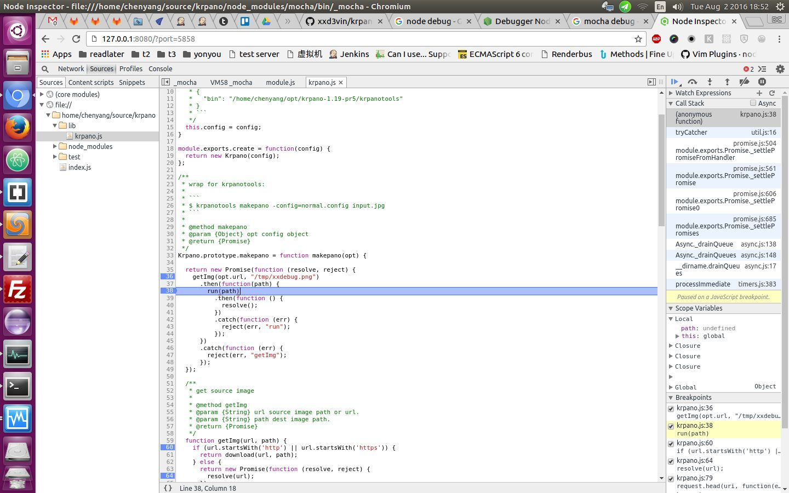

## intro

...

## create helloworld test

```
mkdir test
vim test/test.js
mocha
```

## How to Debug Mocha Tests With Chrome

```
sudo npm install -g node-inspector
```

In a separate Terminal window, run node-inspector with no arguments.

```
node-inspector
```

Go to http://127.0.0.1:8080/debug?port=5858 in Chrome.

Run your Mocha tests.

```
mocha [options] --debug-brk
```

Go back to the browser.



### ref

- http://blog.andrewray.me/how-to-debug-mocha-tests-with-chrome/

## eslint

eslint warning:

```
describe is not defined
```

Put `.eslintrc` with content bellow in `test/` dir.

```json
{
  "env": {
    "mocha": true
  }
}
```

ref: [https://github.com/Kinto/kinto.js/pull/252/files](https://github.com/Kinto/kinto.js/pull/252/files)

## es6

create `test/mocha.opts` file with content bellow:

```
--compilers js:babel-register,jsx:babel-register
```

Don't forget to install `babel-register`

```
npm install babel-register --save-dev
```

## See also

- [Setup mocha for koa project](/2017/07/19/setup-mocha-for-koa-project.html)
