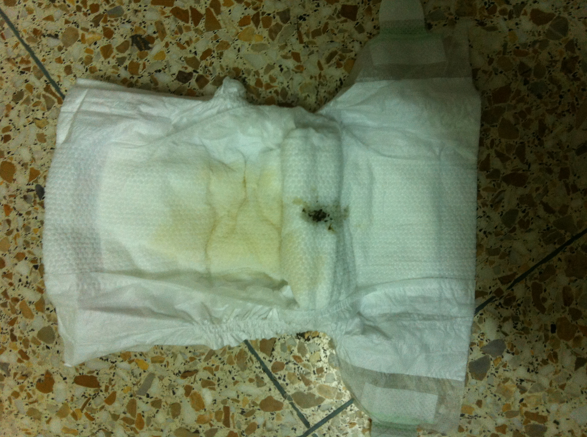
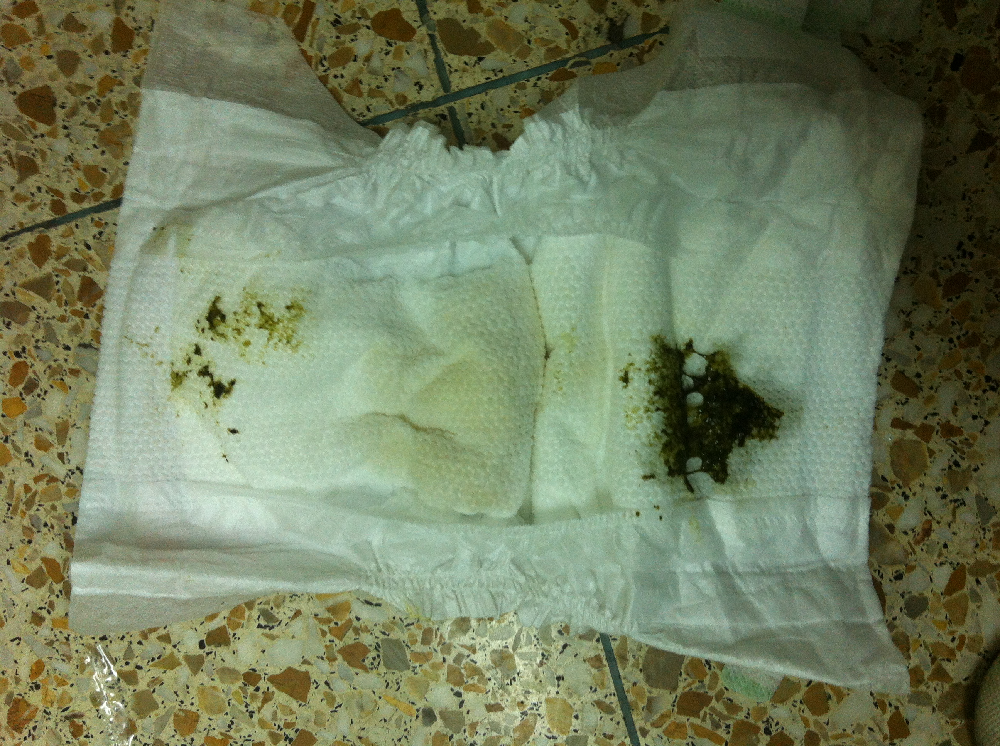

## TOC

- [给宝宝讲故事](/parenting/baby_story.html)
- 孩子发展阶段
  - [两岁](/parenting/two-year-old.html)
  - [三岁](/parenting/three-year-old.html)
- [刷牙](/parenting/toothbrushing.html)

## Language development

给宝宝讲故事的好处在于：宝宝可以近距离观察你的口型变化和发声之间的关系，有助于学习说话。

宝宝很小的时候（比如1～2岁）同时学习汉语和英语，是否会影响语言或者其他方面的发展：[科学松鼠会 一个大脑，两种语言](http://songshuhui.net/archives/79675)

语言学习顺序：如果大环境是单语为主，比如住在中国，家庭中又没有外国人，最好是汉语听说没有问题的情况下再去学习英语。[http://www.yaolan.com/edu/article2007_457572810326.shtml](http://www.yaolan.com/edu/article2007_457572810326.shtml)

## 常用网站

- https://www.aap.org AAP 美国儿科学会

## todo

- Fisher-Price Precious Planet Kick & Play Piano http://www.diapers.com/p/fisher-price-precious-planet-kick-play-piano-72374
- http://en.wikipedia.org/wiki/Diaper

## 全面

首先我要说的是，获得最新的知识，最好还是自己google:"parenting"，另外，可以上豆瓣找到一些关于育婴方面的书籍（@TODO：补充书名）。

- 比较全面的介绍怀孕以及育婴 - [http://www.babycenter.com/](http://www.babycenter.com/) （根据[http://en.wikipedia.org/wiki/BabyCenter](http://en.wikipedia.org/wiki/BabyCenter) 上的介绍，该网站会将广告从知识中剥离出来，这样就会避免出现大陆网站比较多的所谓软文）

## SIDS

在大陆医院没有听说过SIDS，

这是在加拿大一家政府网站看到的（[http://www.phac-aspc.gc.ca/hp-ps/dca-dea/stages-etapes/childhood-enfance_0-2/sids/ssb_brochure-eng.php](http://www.phac-aspc.gc.ca/hp-ps/dca-dea/stages-etapes/childhood-enfance_0-2/sids/ssb_brochure-eng.php)），

顺便查了一下：

[http://baike.39.net/1000/084/16/327282.html](http://baike.39.net/1000/084/16/327282.html)

## 婴儿安全睡眠

- [http://www.phac-aspc.gc.ca/hp-ps/dca-dea/stages-etapes/childhood-enfance_0-2/sids/ssb_brochure-eng.php](http://www.phac-aspc.gc.ca/hp-ps/dca-dea/stages-etapes/childhood-enfance_0-2/sids/ssb_brochure-eng.php)
- [http://gro.co.uk/sleep-central/safe-sleep/baby-zone-information](http://gro.co.uk/sleep-central/safe-sleep/baby-zone-information)


## 营养

- [http://www.orphannutrition.org/chinese](http://www.orphannutrition.org/chinese)

## 婴儿生长

生长情况的测量，已经参考曲线

[http://www.orphannutrition.org/chinese/nutrition-best-practices/growth-charts/using-the-who-growth-charts/](http://www.orphannutrition.org/chinese/nutrition-best-practices/growth-charts/using-the-who-growth-charts/)

## 蒸汽式消毒器

- SCF287, SCF286, SCF285, SCF284 [说明书](scf284_05_dfu_zhs.pdf)

## 新生儿黄疸蓝光治疗的过程

参照 [http://yuer.pcbaby.com.cn/xinde/1205/1105949.html](http://yuer.pcbaby.com.cn/xinde/1205/1105949.html)

<a href="attachments/蓝光治疗过程中宝宝的便便呈现墨绿色稀糊状_照片_1.JPG"></a>

<a href="attachments/蓝光治疗过程中宝宝的便便呈现墨绿色稀糊状_照片_2.JPG"></a>

## 骨密度的说明

美国NIH政府网站。[http://www.niams.nih.gov/Health_info/bone/Chinese/default.asp](http://www.niams.nih.gov/Health_info/bone/Chinese/default.asp)

## 婴儿背带

[attachments/BABYBJORN Baby Carrier Original_888013630.pdf](attachments/BABYBJORN Baby Carrier Original_888013630.pdf)


## 湿巾

- wet ones

## 垃圾袋

http://www.amazon.com/Munchkin-Hammer-Diaper-Dispenser-Colors/dp/B001QKDI48

## words

@todo

- toy leash
- Ju-Ju-Be Be Quick Wristlet Purse bag, Hello Kitty

## 词汇表

- 妈咪包
  - マミーバッグ
  - diapers bag
- 育儿包 - マザーズバッグ
- 母婴室 Baby Care Room

## 母婴室

| 地址 | 是否有母婴室 | 确认方式 |
| ---- | -------------| -------- |
| 北京石景山万达 | 没有 | 通过打(010)88689999咨询的客服得知，万千百货和万达广场都没有母婴室。 |
| 北京石景山万达 - 海底捞 | 没有 | 但是服务员表示可以找一间没人的屋子喂奶。 |

## 保健品

首先说一下，保健品是dietary supplements，直译过来叫做“膳食补充剂”。

有必要先看看这篇文章：[http://songshuhui.net/archives/66216](http://songshuhui.net/archives/66216)

### Baby Ddrops

 - google:"baby ddrops"

用途：补充维生素D

使用方法：1岁以下的婴儿，滴在乳头或者手指（洗手）上，然后让婴儿吮吸至少30秒。每天一滴，可以用90天。

存放方法：40到85华氏度（4.44到29.44摄氏度），保持瓶子竖直。

官网：[http://www.ddropscompany.com/](http://www.ddropscompany.com/)

### Nordic Naturals Baby’s DHA

用途：补充DHA

内容：

- 瓶子
- 滴管

使用方法：

注意：如果婴儿对碘过敏，在食用前需要先咨询医师。

每次用后，彻底清洗滴管。

剂量：

| 婴儿重量 | 剂量 |
| -------- | ---- |
| 5 - 10 lb ( 2.268 - 4.536 kg ) | 1.0 ml |
| 11 - 20 lb ( * - 9.072 kg ) | 2.0 ml |
| 21 - 25 lb ( * - 11.340 kg ) | 3.0 ml |

[metric-conversions.org pounds-to-kilograms-table](http://www.metric-conversions.org/weight/pounds-to-kilograms-table.htm)

存放方法：

最好在打开瓶盖之后的三个月内吃完。

冰箱保存。

官网：[nordicnaturals.com](http://www.nordicnaturals.com/en/Products/Product_Details/514/?ProdID=1541)

## 玩具

有些玩具上写着（比如费雪的海马，fisher price seahorse）

```
NEW MATERIAL ONLY       ： 新材料，即这不是废旧材料回收制成
REG. NO. 05T-1171507    ：？？？
CONTENT                 ：填充物
POLYSTER FIBERS         ：聚酯纤维，其实就是涤纶

SURFACE WASHABLE              ：表面可洗
LAVABLE UNIQUEMENT EN SURFACE ：法语的“表面可洗”
```

## 参考

- Baby Gear （想花钱，看这里） - http://www.spearmintbaby.com/category/baby-gear/

## 作息时间表

Cooper的作息时间表：[https://calendar.google.com/calendar/embed?src=7pa8us6jspitrkvjvfrkq21sck%40group.calendar.google.com&ctz=Asia/Shanghai](https://calendar.google.com/calendar/embed?src=7pa8us6jspitrkvjvfrkq21sck%40group.calendar.google.com&ctz=Asia/Shanghai)

## Cooper一些规律性表现

- 右手用叉子叉火龙果，如果火龙果从叉子上掉下来了，他会用左手把火龙果捡起来然后插在叉子上（不是用右手拿叉子主动去叉），然后再放进嘴里。
- 食物掉在地上，必须捡起来吃了
- 拒绝穿新鞋子。一旦习惯了新的鞋子，就不穿旧的鞋子了。3岁之后慢慢的改善了
- 不带帽子。一旦习惯了带帽子，出门必须带帽子
- 马桶盖必须跟原来保持一致（在家的时候，必须把垫圈放下来，才能离开厕所，即使是别人上过厕所，如果被Cooper看到了，也会强制按照他的要求来做。2018年初二跟老婆回娘家，家里有两个卫生间，他会要求一个必须放下垫圈，另一个要求必须盖上马桶盖，这才发现他是以第一次见到的马桶的状态来作为以后的行为准则）

## 帮助Cooper养成的好习惯

- 身体好，生病（感冒发烧）次数比较少（进入幼儿园三个月以来，是班里唯一一个没有因为生病而请假的宝宝）
- 在1岁到2岁之间比较胖（奶水充足）

## Cooper不好的习惯

- 没有帮助Cooper建立起来良好的午休习惯（由于父母在宝宝成长的关键时期，没有在中午提供良好的睡眠环境），这也导致了从下午4，5点到睡觉前，有几次懵逼的状态。但是如果Cooper中午再幼儿园睡过了，晚上即使8点上床，关了灯，他也会一直喋喋不休说个不停，到10点左右才能入睡。所以在一定程度上，说不定Cooper本来就是睡眠要求少的宝宝，
- 晚上睡觉时间不固定，8点到10点不等，在过年过节，或者是父母比较忙的时候，有过拖延到11点多睡觉的情况
- Cooper说话比较晚，相对于同龄男孩。快三岁半的时候还不能跟同龄的孩子沟通，这也导致他目前没有能玩到一块的小朋友，因为大家跟他说话，他不是回答，而是重复别人说的话。
- Cooper不怎么吃肉，主要是父母不是很会做饭，所以在做饭的时候都是以素菜为主，因为比较做法简单，比如西红柿炒鸡蛋，炒角瓜等。在外面饭店吃饭的时候，如果有肉，也会担心不好嚼不好消化，所以很少喂给Cooper吃，或者将肉弄碎了再喂给Cooper吃。有些可以拿在手里吃，比如鸡腿，因为爸爸担心会弄脏衣服/地面不好收拾，所以从生下来到3岁半，都没有让Cooper自己拿着鸡腿啃过。
- Cooper 2017-2018冬季 咳嗽次数很多，好像从2017-11月份左右，就开始陆续咳嗽了（这里有一个争议，Cooper妈妈认为这段时间并没有比往年咳嗽的次数更多）。在经过几个月的场时候发现，如果当天喝的水足够多，比如喝了2x保温杯／天的温水，那么当天就几乎不咳嗽（这个经验是Cooper妈妈得出的）。而且这段时间晚上12点到凌晨4点之间，也会突然开始咳嗽。
- 从2018农历年春节左右开始，Cooper开始会在一些活动上选择跟爸爸／妈妈进行。比如晚上洗漱，一般是跟妈妈（可能是因为妈妈比较温柔，不会强迫Cooper做不愿意做的事情，即使一开始不愿意，也会很有耐心的说服Coopr），如果一开始问他：跟爸爸一块洗漱吧，他会立刻说不，如果再问他：跟妈妈一块洗漱，他就会说可以。所以在这种特点下，Cooper爸爸妈妈会先说他不愿意的那一方，然后再换成愿意的那一方，这样Cooper就会很自觉的去做了。

## Cooper的一些特点

- 好像是从小开始（到目前，3岁半），晚上睡觉，前半夜（从入睡，8点最早，10点最晚，到凌晨2点左右），后脑勺会流很多汗，把枕巾都浸湿了。

## Sport

### Balance Bike

- Puky [https://www.puky.net/](https://www.puky.net/)

### Electric Balance Bike

- [STACYC by Stability Cycle](https://www.stacycstabilitycycle.com/)

## janod世界地图拼图

[https://post.smzdm.com/p/700186/](https://post.smzdm.com/p/700186/)